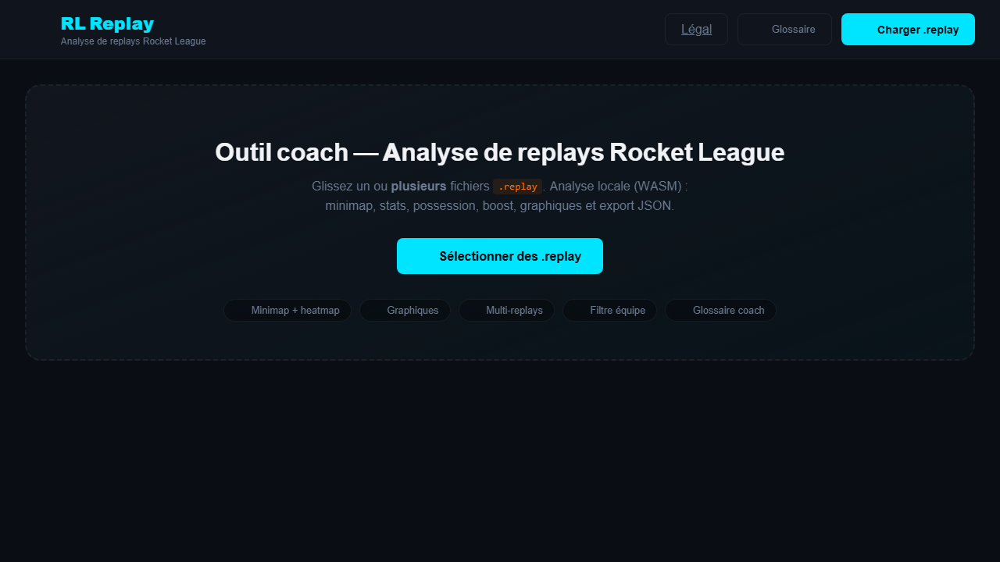

# RL Replay

[](https://github.com/dariohd/RLReplay/actions/workflows/ci.yml)



Outil coach **100 % navigateur** pour analyser les replays Rocket League — parsing WASM, aucun upload serveur.

| | |
|---|---|
| **URL production** | https://rl-replay.vercel.app |
| **URL miroir** | https://dariohd.github.io/RLReplay/ |
| **Dépôt GitHub** | [github.com/dariohd/RLReplay](https://github.com/dariohd/RLReplay) |
| **Notes techniques** | [docs/ARCHITECTURE.md](docs/ARCHITECTURE.md) |

---

## Stack technique

- **Vite 8** + JavaScript vanilla (ES modules)
- **@rlrml/subtr-actor** — parsing replay en **WebAssembly**
- **Canvas 2D** : minimap, graphiques, heatmaps
- **Lucide** (icônes)
- Polices auto-hébergées
- Déploiement : **Vercel** + **GitHub Pages** (workflow CI)

---

## Fonctionnalités coach

- **Minimap 2D** + lecture frame par frame + marqueurs (buts, tirs, démos)
- Filtre équipe : tous / bleu / orange / mon équipe
- **Multi-replays** : charger plusieurs `.replay`, onglet **Comparer**
- Graphiques : boost, positionnement, possession, distribution des tirs
- Stats, touches, mécaniques, heatmaps
- **Glossaire** intégré (possession, last man, boost ledger…)
- **Export JSON** complet des analyses
- Page **Mentions légales**
- 100 % client : confidentialité totale (pas de serveur de replay)

---

## Structure du projet

```
RLReplay/
├── index.html, mentions-legales.html
├── src/
│   ├── main.js           # Point d'entrée, UI
│   ├── parser.js         # WASM replay
│   ├── minimap.js, charts.js, compare.js
│   └── glossary.js
├── css/styles.css
├── fonts/
├── public/               # Assets statiques Vite
├── scripts/vendor-fonts.mjs
├── vite.config.js
├── vercel.json
└── .github/workflows/deploy.yml
```

---

## Prérequis

- Node.js 20+
- Fichiers `.replay` Rocket League (PC)

---

## Développement local

```bash
npm install
npm run dev
```

→ **http://localhost:5173**

---

## Scripts

| Commande | Description |
|----------|-------------|
| `npm run dev` | Serveur Vite HMR |
| `npm run build` | Build production → `dist/` |
| `npm run preview` | Preview du build |

---

## Déploiement

### Vercel (principal)

Push `main` → déploiement automatique si projet lié.

### GitHub Pages

Workflow manuel `.github/workflows/deploy.yml` — lancer après avoir activé Pages (Settings → Pages → GitHub Actions).

Build manuel avec base path :

```bash
VITE_BASE_PATH=/RLReplay/ npm run build
```

Activer : **Settings → Pages → Source : GitHub Actions**.

---

## URLs propres

`vercel.json` : `cleanUrls: true`, redirect mentions-legales.

---

## Confidentialité

Tout le parsing s'exécute dans le navigateur via WASM. Aucun replay n'est transmis à un serveur tiers.

---

## Contact

- **Développement** : Hugo Davion — [bulletonsite.com](https://bulletonsite.com)
